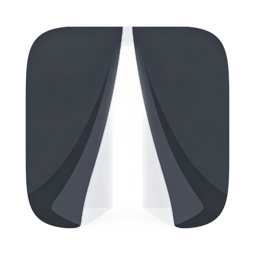
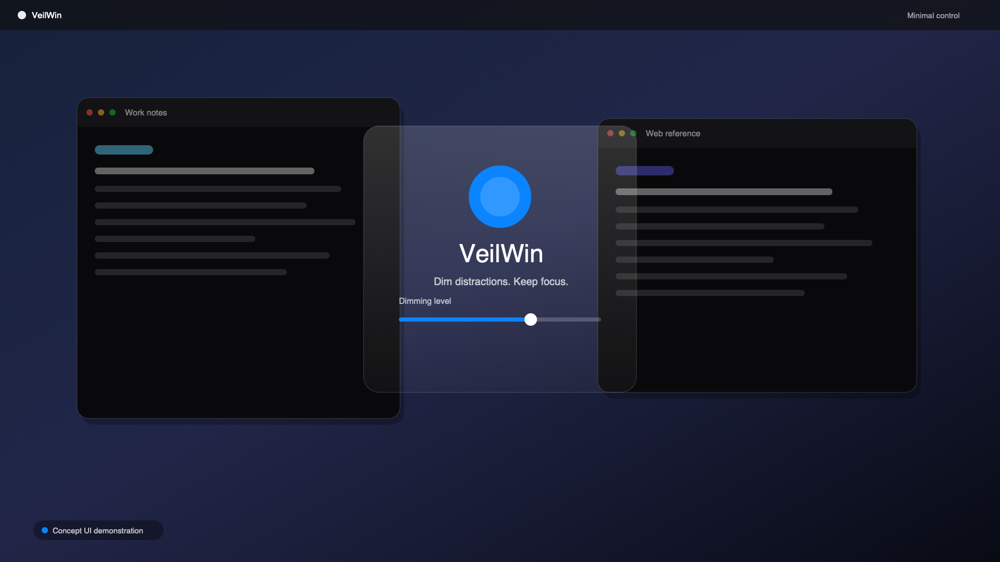
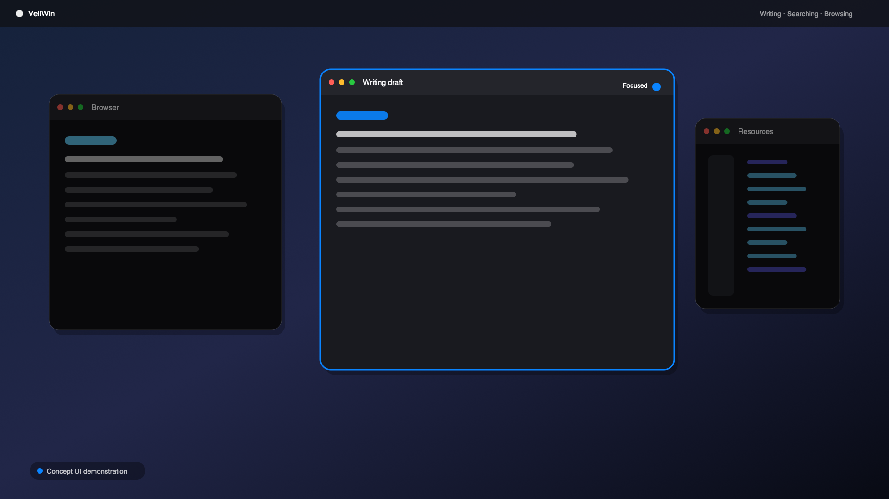
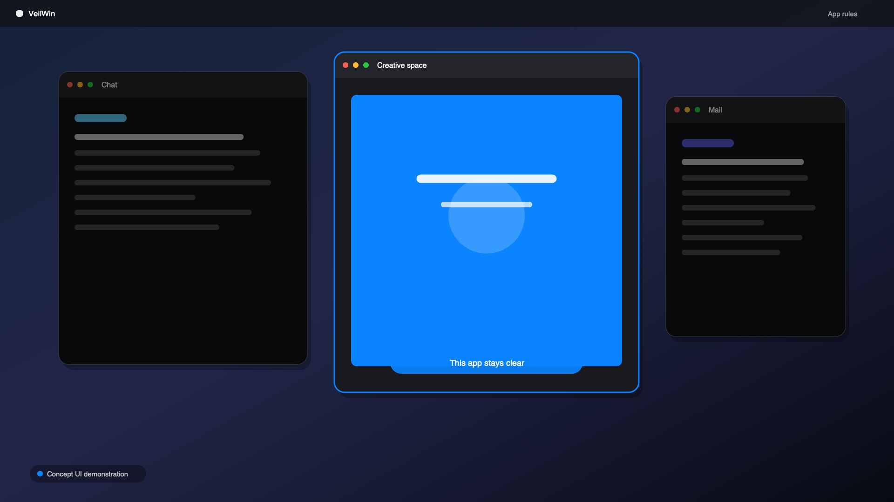
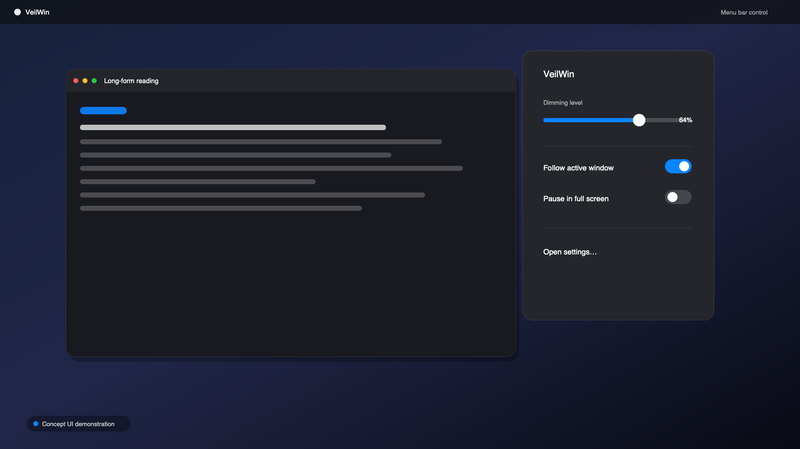

  

<h1 align="center">VeilWin · 幕窗</h1>

  <strong>Dim everything. Keep only the window you're working on.</strong>

  A cross-platform (macOS / Windows) window-dimming & focus tool that fades your entire screen 
  into the dark — except the window that has your attention.

  <a href="README.zh-CN.md">简体中文</a> ·
  <a href="https://veilwin.com">Website</a> ·
  <a href="https://veilwin.com/en/docs/introduction">Documentation</a> ·
  <a href="https://veilwin.com/#download">Download</a>

  
  

  

---

## Why VeilWin

Focus modes mute notifications, but they can't mute what you **see**. VeilWin works at the visual layer: the moment it's on, everything except your focused window — the desktop, other apps, the second monitor — sinks under a translucent veil. Your attention is physically corralled into one window.

It's not a wallpaper, not a blue-light filter, not a notification blocker. It's a spotlight for your screen.

## Features

- **Window-level dimming** — Everything fades except the window you're working on. Dim intensity (0–100%), tint color (warm tints for late nights), and a smooth 180 ms transition are all tunable.
- **Focus modes** — Keep the frontmost single window bright, or the whole app (IDE + terminal together). A focus limit of 1–8 keeps your most recent N windows bright — invaluable when writing against a reference document.
- **Multi-display as a first-class citizen** — Each display highlights its own focused window by default, or dim only the displays without focus. Per-display intensity override and per-display profile binding included; a presentation/streaming display can be excluded entirely.
- **App rules** — "Never dim" apps (media players) stay bright forever; "pause when frontmost" apps suspend dimming entirely while active. Fullscreen video is never dimmed.
- **Global hotkeys** — Toggle dimming (⌃⌥⌘H / Ctrl+Alt+Win+H), step intensity, switch profiles — all without leaving the keyboard. Hold **Fn** (macOS) or **Ctrl+Alt** (Windows) to temporarily reveal the desktop, release to resume.
- **Profiles** — Save intensity, tint, animation and focus settings as named profiles. Switch with one hotkey or from the tray, or let the system light/dark appearance pick the profile for you.
- **Eye-care automation** — Dim automatically at night, restore in the morning, follow the system theme, and 20-20-20 rest reminders with optional forced breaks.
- **Quiet by design** — Lives in the tray, launches at login, no popups. Mission Control / Alt-Tab automatically pauses dimming so you can see every window while picking one. UI in 9 languages.

  
  

  

## Download

| Platform | Requirement | Download |
|----------|-------------|----------|
| macOS (universal, Intel / Apple Silicon) | macOS 10.15+ | [veilwin_latest_universal.dmg](https://download.floweb.cn/veilwin_latest_universal.dmg) |
| Windows (x64) | Windows 10+ | [veilwin_latest_x64-setup.exe](https://download.floweb.cn/veilwin_latest_x64-setup.exe) |

Or grab it from the [download page](https://veilwin.com/#download). The free tier is fully featured — see the website for licensing details.

> **macOS note:** VeilWin needs Accessibility permission to know which window is focused. All window processing happens locally — see [Privacy](#privacy).

## Privacy

- All window detection and dimming run **locally**. No window information ever leaves your machine.
- No account system.
- Anonymous, opt-out usage analytics (one toggle in Settings → General → Privacy); everything else stays on your device.

## Links

- Website: [veilwin.com](https://veilwin.com)
- Documentation: [veilwin.com/en/docs](https://veilwin.com/en/docs/introduction)
- Contact: contact@once.work
