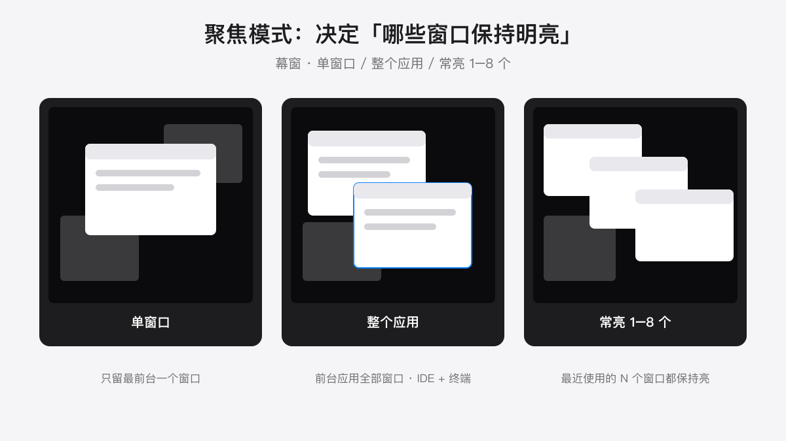
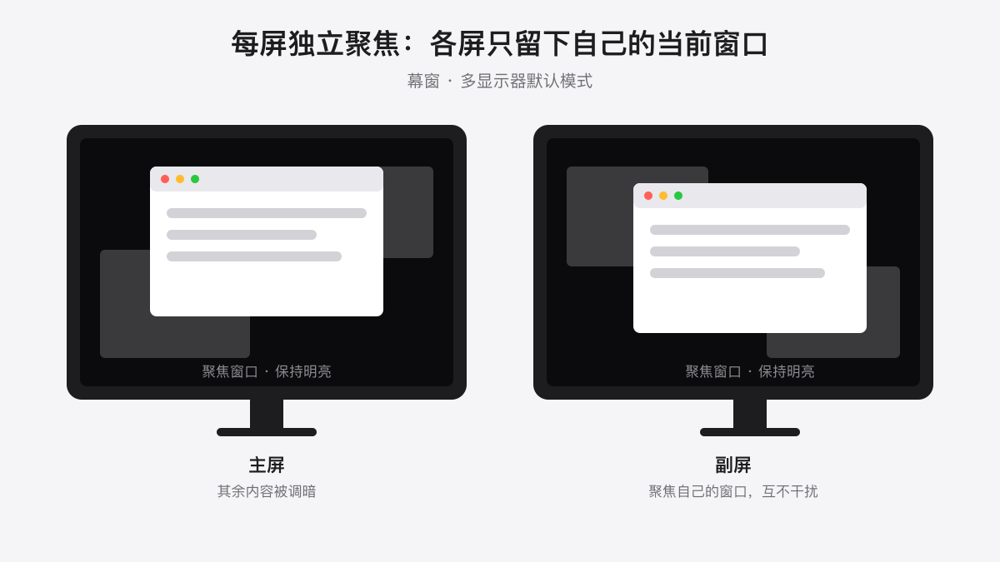
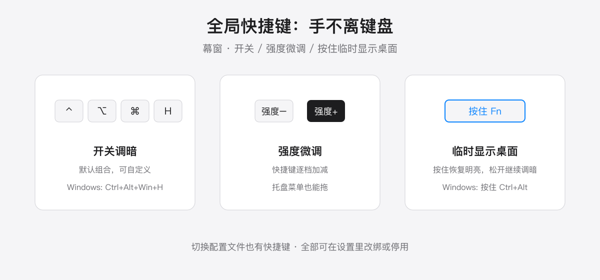

  

<h1 align="center">幕窗 · VeilWin</h1>

  <strong>调暗一切，只留下你正在工作的窗口。</strong>

  跨平台（macOS / Windows）窗口调暗与专注工具：开启之后，除当前聚焦窗口外， 
  桌面、其他应用、副屏全部沉入一层半透明遮罩之下——注意力被「物理上」收拢到一个窗口里。

  <a href="README.md">English</a> ·
  <a href="https://veilwin.com">官网</a> ·
  <a href="https://veilwin.com/zh/docs/introduction">使用文档</a> ·
  <a href="https://veilwin.com/#download">下载</a>

  
  

  

---

## 为什么是幕窗

系统的「专注模式」管的是通知，管不了你**看到**什么。幕窗工作在视觉层面：它不是壁纸，不是护眼模式，也不是通知拦截——它是屏幕上的聚光灯。聚焦窗口保持明亮，其余内容全部变暗，你的视线里只剩下该看的东西。

## 功能特性

- **窗口级调暗** —— 除当前工作窗口外全部调暗。强度（0–100%）、色调（夜间可换暖色遮罩）、180ms 平滑过渡动画均可自由调节。
- **聚焦模式** —— 只留当前一个窗口，或留住整个应用（IDE + 终端一起亮）；常亮数量 1–8 可调，让最近使用的 N 个窗口保持明亮——对照文档写东西时特别救命。
- **多显示器一等公民** —— 默认每台显示器各自聚焦自己的当前窗口，或只调暗没有焦点的屏幕；支持单屏强度覆盖、单屏绑定配置文件；投影/推流屏可以彻底停用调暗。
- **应用规则** —— 「永不调暗」名单（如播放器）始终明亮；「前台暂停」名单内的应用切到前台时整体暂停调暗；全屏视频永不调暗。
- **全局快捷键** —— 调暗开关（⌃⌥⌘H / Windows 为 Ctrl+Alt+Win+H）、强度加减、切换配置文件，手不离键盘。**按住 Fn**（Windows 为 Ctrl+Alt）调暗临时消失，松开立刻恢复——从桌面拖文件进窗口不用先关调暗。
- **配置文件** —— 强度、色调、动画、聚焦模式存成预设，托盘或快捷键一键切换；可跟随系统浅色/深色外观自动激活对应配置。
- **自动化护眼** —— 夜间自动调暗、清晨自动恢复，跟随系统主题，20-20-20 节奏休息提醒，可强制休息。
- **安静的设计** —— 托盘驻留、开机自启、无弹窗；打开调度中心 / Alt-Tab 时自动暂停调暗，选窗口时当然要看清所有窗口；界面支持 9 种语言。

  
  

  
  

## 下载

| 平台 | 系统要求 | 下载 |
|------|----------|------|
| macOS（universal，Intel / Apple Silicon） | macOS 10.15+ | [veilwin_latest_universal.dmg](https://download.floweb.cn/veilwin_latest_universal.dmg) |
| Windows（x64） | Windows 10+ | [veilwin_latest_x64-setup.exe](https://download.floweb.cn/veilwin_latest_x64-setup.exe) |

也可以访问[官网下载页](https://veilwin.com/#download)。免费版功能完整无阉割，授权详情见官网。

> **macOS 提示**：幕窗需要辅助功能（Accessibility）权限来识别焦点窗口。所有窗口处理均在本地完成，详见[隐私说明](#隐私)。

## 隐私

- 所有窗口检测与调暗都在**本地**完成，不上传任何窗口信息。
- 没有账号体系。
- 应用内有匿名使用统计，可在「设置 → 通用 → 隐私」一键关闭；除此之外没有任何数据离开你的设备。

## 链接

- 官网：[veilwin.com](https://veilwin.com)
- 使用文档：[veilwin.com/zh/docs](https://veilwin.com/zh/docs/introduction)
- 联系：contact@once.work
